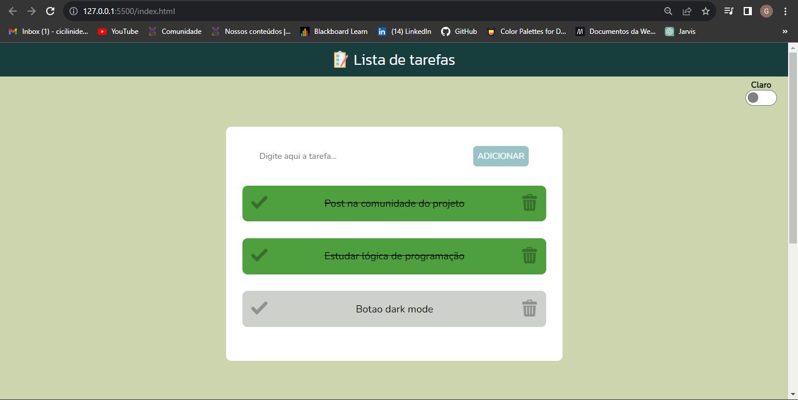

# 📋 Projeto To-Do List

O Projeto To-Do List é uma aplicação simples para ajudar a manter o controle das suas tarefas diárias. Com esta aplicação, você pode adicionar, verificar e excluir tarefas facilmente.

## Funcionalidades

- **Adicione Tarefas:** Você pode adicionar novas tarefas digitando-as na caixa de entrada e clicando no botão "ADICIONAR".

- **Marque as Tarefas:** Depois de concluir uma tarefa, você pode marcá-la como concluída clicando no botão de verificação.

- **Exclua Tarefas:** Se você quiser remover uma tarefa da lista, basta clicar no ícone da lixeira.

- **Modo Claro/Escuro:** Você pode alternar entre os modos claro e escuro da aplicação para uma experiência de usuário personalizada.

## Uso

1. Digite o nome da tarefa na caixa de entrada.
2. Clique no botão "ADICIONAR" para adicionar a tarefa à lista.
3. Marque uma tarefa como concluída clicando no botão de verificação.
4. Exclua uma tarefa clicando no ícone da lixeira ao lado dela.

## Tecnologias Utilizadas

- HTML: Para a estrutura da página.
- CSS: Para estilização.
- JavaScript: Para funcionalidades interativas.

